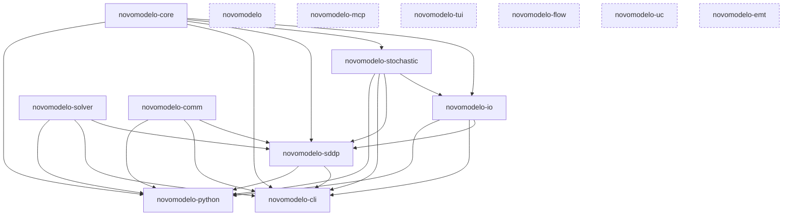

# Architecture

Novomodelo is a Cargo workspace of focused Rust crates, each with a single
responsibility and an explicit dependency boundary. This document is a
developer-facing map of the workspace: what each crate owns, how they depend
on one another, and the build-time choices that shape the graph. It is a
starting point, not a replacement for each crate's own README — follow the
links at the end of each section for the full detail.

For the mathematical/methodology reference (SDDP formulation, cut derivation,
risk measures, hydro production models) and for user-facing installation and
CLI usage, see the [unified docs site](https://docs.novomodelo.invalid/).

## Crate responsibilities

### Foundation

- **[`novomodelo-core`](crates/novomodelo-core/README.md)** — The shared power-system
  data model: buses, lines, hydro/thermal/pumping/contract/non-controllable-source
  entities, network and cascade topology, the temporal (stage/block) model, the
  horizon graph (`HorizonGraph`) declaring the study's node/transition topology,
  pre-resolved penalty and bound tables, and the immutable `System` container
  built by `SystemBuilder`. Carries no solver, I/O, or algorithm
  dependencies — every other crate in the workspace consumes `System` by
  shared reference. Enforces declaration-order invariance (entities sort into
  canonical order at construction) so results never depend on input ordering.

### Infrastructure (depend only on `novomodelo-core`, or on nothing)

- **[`novomodelo-solver`](crates/novomodelo-solver/README.md)** — Backend-agnostic LP
  solver abstraction (`SolverInterface` trait), with HiGHS as the default
  backend and an optional vendored CLP/CoinUtils backend. Owns the 12-level
  retry escalation ladder for numerically difficult LPs and the per-phase
  `HighsProfile`/`ProfiledSolver` tuning wrapper. Has **no** intra-workspace
  dependency — it is pure infrastructure that algorithm crates consume through
  a generic type parameter (compile-time monomorphization, never `dyn
SolverInterface`).
- **[`novomodelo-comm`](crates/novomodelo-comm/README.md)** — Pluggable communication
  backend abstraction (`Communicator` / `SharedMemoryProvider` traits), with a
  zero-overhead single-process `LocalBackend` always available and an MPI 4.x
  `FerrompiBackend` behind the `mpi` feature (built on the external
  [ferrompi](https://github.com/cobre-rs/ferrompi) crate, not a workspace
  member). Also has **no** intra-workspace dependency — like `novomodelo-solver`,
  it is consumed through a generic bound, so a Novomodelo binary contains exactly
  one backend instantiation.
- **[`novomodelo-stochastic`](crates/novomodelo-stochastic/README.md)** — Stochastic
  process models: PAR(p) inflow time-series models, spectral spatial
  correlation, deterministic communication-free noise generation (SipHash-1-3
  seed derivation), and the opening-tree / forward-sampler infrastructure
  consumed by iterative scenario-based algorithms. Depends only on
  `novomodelo-core` for entity types; solver-agnostic and comm-agnostic.

### Case I/O

- **[`novomodelo-io`](crates/novomodelo-io/README.md)** — The sole boundary between the
  filesystem and `novomodelo-core`/`novomodelo-stochastic` types. `load_case` runs a
  five-layer validation pipeline (structural, schema, referential integrity,
  dimensional consistency, semantic) over a case directory of JSON and Parquet
  files, resolves the three-tier penalty/bound cascade, assembles scenario
  models (optionally estimating PAR parameters from historical data), and
  produces a validated `System`. `write_results` writes Parquet result tables,
  FlatBuffers policy checkpoints, and JSON manifests. Depends on `novomodelo-core`
  (the types it populates) and `novomodelo-stochastic` (the scenario models it
  assembles).

### Algorithm

- **[`novomodelo-sddp`](crates/novomodelo-sddp/README.md)** — The Stochastic Dual
  Dynamic Programming algorithm: forward-pass scenario simulation, backward-pass
  Benders cut generation, cut management (Level-1/LML1/dominated-cut pruning
  and Dynamic Cut Selection), CVaR risk measures, convergence monitoring,
  policy warm-start/resume, and the post-training simulation pipeline. Depends
  on all four infrastructure/I-O crates below it — `novomodelo-core` (data model),
  `novomodelo-io` (loading case data and writing results), `novomodelo-solver` (LP
  subproblem solving, via a generic `SolverInterface` bound), and `novomodelo-comm`
  (distributed collectives, via a generic `Communicator` bound) — plus
  `novomodelo-stochastic` for scenario generation. Because it is generic over both
  `SolverInterface` and `Communicator`, `novomodelo-sddp` itself carries **no**
  `mpi`/`highs`/`clp` selection logic of its own beyond forwarding the
  `highs`/`clp` features to `novomodelo-solver` — backend choice is made by the
  binary that instantiates it.

### Entry points

- **[`novomodelo-cli`](crates/novomodelo-cli/README.md)** — The `novomodelo` binary:
  `run`/`validate`/`init`/`schema`/`version` subcommands
  with a typed `CliError` → exit-code contract. Wires `novomodelo-io`,
  `novomodelo-stochastic`, `novomodelo-solver`, `novomodelo-comm`, and `novomodelo-sddp` into a
  single executable. Selects the concrete solver backend (`highs`/`clp`
  features) and communication backend (`--comm-backend`, forwarding to
  `novomodelo-comm`'s `mpi` feature) for the process.
- **[`novomodelo-python`](crates/novomodelo-python/README.md)** — PyO3 bindings
  (`cdylib`, module name `_native`) exposing case loading, validation,
  training, simulation, and Arrow-backed zero-copy result inspection to
  Python. Depends on the same five crates as `novomodelo-cli` (`novomodelo-core`,
  `novomodelo-io`, `novomodelo-sddp`, `novomodelo-stochastic`, `novomodelo-solver`, `novomodelo-comm`)
  and mirrors its `highs`/`clp` backend-selection features, but is **excluded**
  from the Cargo workspace (`exclude` in the workspace `Cargo.toml`) because
  building it requires a Python interpreter and PyO3 — the exclusion keeps
  `cargo test --workspace` and `cargo-dist` from requiring one. Built
  separately via `maturin`.
- **[`novomodelo`](crates/novomodelo/README.md)** — The umbrella crate. Currently an
  empty skeleton (`src/lib.rs` re-exports nothing yet, `Cargo.toml` has no
  dependencies) reserved for a future single-dependency convenience re-export
  of the ecosystem; for all current work, depend on the specific `novomodelo-*`
  crates you need.

### Reserved crates (not yet implemented)

Reserved crate names hold skeleton stub files — each with a `Cargo.toml`
(empty `[dependencies]`), a stub `src/lib.rs` or `src/main.rs`, and a README
stating their intended future scope — until their functionality is implemented.
None currently build any functionality or participate in the dependency graph below:

- **[`novomodelo-mcp`](crates/novomodelo-mcp/README.md)** — reserved for an MCP
  (Model Context Protocol) server binary for AI-agent integration; depend on
  `novomodelo-cli` for command-line interaction until this lands.
- **[`novomodelo-tui`](crates/novomodelo-tui/README.md)** — reserved for a `ratatui`
  terminal UI; depend on `novomodelo-cli` until this lands.
- **[`novomodelo-flow`](crates/novomodelo-flow/README.md)** — reserved for AC/DC power
  flow algorithms (Newton-Raphson, fast-decoupled, etc.).
- **[`novomodelo-uc`](crates/novomodelo-uc/README.md)** — reserved for a MILP-based unit
  commitment solver for hydrothermal dispatch.
- **[`novomodelo-emt`](crates/novomodelo-emt/README.md)** — reserved for electromagnetic
  transient analysis algorithms.

## Dependency graph

Arrows point from dependency to dependent (an arrow from `novomodelo-core` to
`novomodelo-io` means `novomodelo-io` depends on `novomodelo-core`). Every edge below is a
direct `path = "../..."` dependency declared in a crate's `Cargo.toml`
`[dependencies]` — none are inferred or transitive-only. The five reserved
crates (`novomodelo-mcp`, `novomodelo-tui`, `novomodelo-flow`, `novomodelo-uc`, `novomodelo-emt`) and
the empty `novomodelo` umbrella crate have no dependency edges yet and are shown
detached.

The diagram shows direct workspace-member dependencies as declared in each crate's
`Cargo.toml` `[dependencies]` — none are inferred or transitive-only. `novomodelo-cli`
and `novomodelo-python` depend directly on `novomodelo-core`, `novomodelo-io`, `novomodelo-solver`,
`novomodelo-comm` and `novomodelo-stochastic` in addition to `novomodelo-sddp`; they do not reach
those crates only transitively through `novomodelo-sddp`.

## Case file formats — JSON for structure, Parquet for bulk

`novomodelo-io` reads a case directory of JSON and Parquet files, and the split
between the two is a rule, not a per-file judgement call:

- **JSON** carries **structure and identity**: the entity declarations (buses,
  lines, hydro/thermal/pumping/contract/non-controllable-source), the network
  and cascade topology, the temporal (stage/block) model, the study
  configuration, and the policy graph's `nodes[]` node/transition topology.
  These are small, hand-authored, and describe the shape of the problem.
- **Parquet** carries anything whose size **scales with entities × stages ×
  blocks × scenarios**: inflow scenario series, estimated stochastic-model
  parameters, and the result tables (primal / dual / equipment / cost). These
  are machine-written columnar bulk, never hand-edited.

Stated as an invariant so it is not re-argued at each new input surface: a
quantity that grows with the study's entity/stage/block/scenario dimensions goes
in Parquet; the structure the solver builds against goes in JSON.

**A graph is structure, so `nodes[]` is JSON — within a bounded ceiling.** The
node/transition graph declares the study's topology, so it lands on the JSON
side. That is safe only because the _declared_ graph stays small: with fan width
`K` and horizon `T`, a fan is `O(K)` nodes and a recombining hybrid (a chain
carrying a bounded fan) is `O(T + K)` nodes — both JSON-sized. A fully-enumerated
`K^T` scenario tree is not: its node count is exponential in the horizon, and it
is never materialized as an explicit `nodes[]` array. When enumeration is
requested, the enumerated root→leaf path count is computed with checked
arithmetic and a `u64` overflow is a hard setup error — so an exponential tree is
**guard-rejected** before the solver runs, and it exists only as the implicit
product of a small declared graph. "Structure goes in JSON" therefore does not
read as "any graph goes in JSON".

## Build & feature notes

- **Solver backend selection is compile-time and mutually exclusive.**
  `novomodelo-solver`'s `highs` (default) and `clp` features gate two entirely
  separate backends (`HighsSolver` / `ClpSolver`); enabling both, or neither,
  is a compile error. `novomodelo-sddp`, `novomodelo-cli`, and `novomodelo-python` each
  re-declare `highs`/`clp` features that forward to **both**
  `novomodelo-solver/<feature>` and (for `novomodelo-sddp`) their own per-phase profile
  code, so a binary-level `--features clp` build propagates consistently down
  the graph instead of leaving one crate on its own default.
- **Communication backend selection is compile-time (feature) + runtime
  (`BackendKind`).** `novomodelo-comm` compiles in `LocalBackend` unconditionally
  and `FerrompiBackend` only behind its `mpi` feature (with `numa` and
  `shared-memory` as further opt-in extensions). `novomodelo-sddp` has no `mpi`
  feature of its own — it is generic over `Communicator`, so MPI support is
  purely a `novomodelo-comm` build-time concern plus a `novomodelo-cli`
  `mpi = ["novomodelo-comm/mpi"]` forward; `novomodelo-python` does not currently
  forward an `mpi` feature. At runtime, `create_communicator(BackendKind)`
  picks the active backend (`Auto`/`Mpi`/`Local`) independently of which
  features were compiled in.
- **`novomodelo-python` is excluded from the workspace.** The root `Cargo.toml`
  lists it under `[workspace] exclude` because PyO3 requires a Python
  interpreter; excluding it keeps `cargo test --workspace` and `cargo-dist`
  from requiring one. It is built separately via `maturin` and pins its own
  `edition`/`rust-version` rather than inheriting `[workspace.package]`.
- **Workspace-wide lints forbid `unsafe`.** `[workspace.lints.rust]` sets
  `unsafe_code = "forbid"`; `novomodelo-comm` (FFI `unsafe impl Send`/`Sync` for
  `FerrompiBackend`), `novomodelo-solver` (HiGHS/CLP FFI), and `novomodelo-python`
  (PyO3 macro-generated code) each override this to `"allow"` in their own
  `Cargo.toml`, re-declaring the rest of the workspace's clippy lints
  manually since Cargo does not allow combining `lints.workspace = true`
  with per-lint overrides.

## Links

| Resource          | URL                                                        |
| ----------------- | ---------------------------------------------------------- |
| Repository        | <https://github.com/ons-ccee-epe/novomodelo>                        |
| Unified docs site | <https://docs.novomodelo.invalid/>                               |
| CHANGELOG         | <https://github.com/ons-ccee-epe/novomodelo/blob/main/CHANGELOG.md> |
